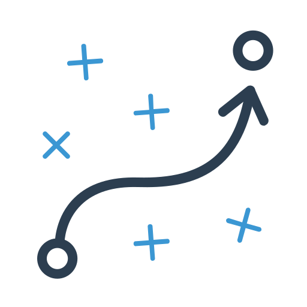

# 🗺️ Dataset Generator per Goal Recognition su Mappe a Griglia


<p align="center">
    
</p>

---

## 📖 Descrizione del Progetto
Questo repository contiene un programma Python che genera un **dataset di percorsi** su mappe a griglia *4-connected* (movimento solo orizzontale e verticale).  
Il dataset è pensato per essere usato in esperimenti di **Goal Recognition** tramite reti neurali grafiche (GNN), ad esempio con **PyTorch Geometric**.  

---

## 🎯 Obiettivo
- Prendere in ingresso una **mappa** in formato JSON contenente:  
  - la matrice della griglia (`map`)  
  - la coppia sorgente/destinazione (`source_destination`)  
  - metadati (`id`, `map_id`, `size`, `percentage_obstacles`)  
- Calcolare percorsi validi dalla sorgente alla destinazione (es. DFS con varianti per evitare soluzioni sub-ottimali).  
- Convertire ogni percorso in **entry di dataset** riutilizzabili in esperimenti di Goal Recognition.  

---

## 🗂️ Struttura del Dataset
Ogni riga del file iniziale rappresenta una **mappa**:
```json
{
  "map": [[0,0,0,...], [0,0,0,...], ...],
  "source_destination": [172, 255],
  "percentage_obstacles": "0.00",
  "id": 10000,
  "map_id": 1000,
  "size": 16
}
```

Dopo la generazione dei percorsi, ogni mappa produce più entry:
una per ciascun passo del percorso
con encoding che distingue:
celle libere,
posizione attuale dell’agente,
celle già visitate.

## 📦 Librerie Utilizzate
(da completare e aggiornare nei vari commit)

## 📌 Roadmap / ToDo
Implementare diversi algoritmi di pathfinding (DFS e varianti)
Aggiungere supporto a diverse dimensioni di griglia
Creare funzioni di esportazione diretta verso formato PYG
Integrare test automatici sul dataset

## 📚 Note Future
Il dataset generato sarà utilizzato in un progetto di Goal Recognition tramite Graph Neural Networks (GNN).
Questo repository si concentra solo sulla parte di dataset generation.
